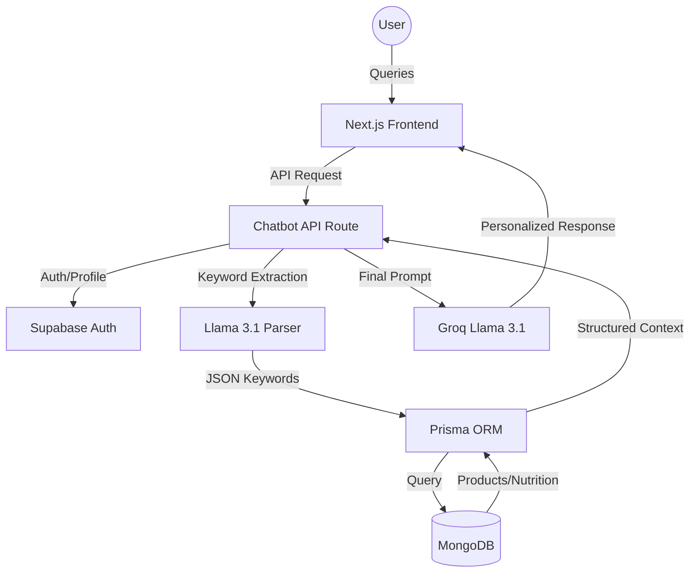
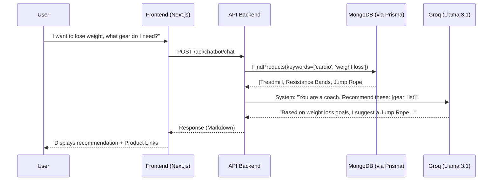
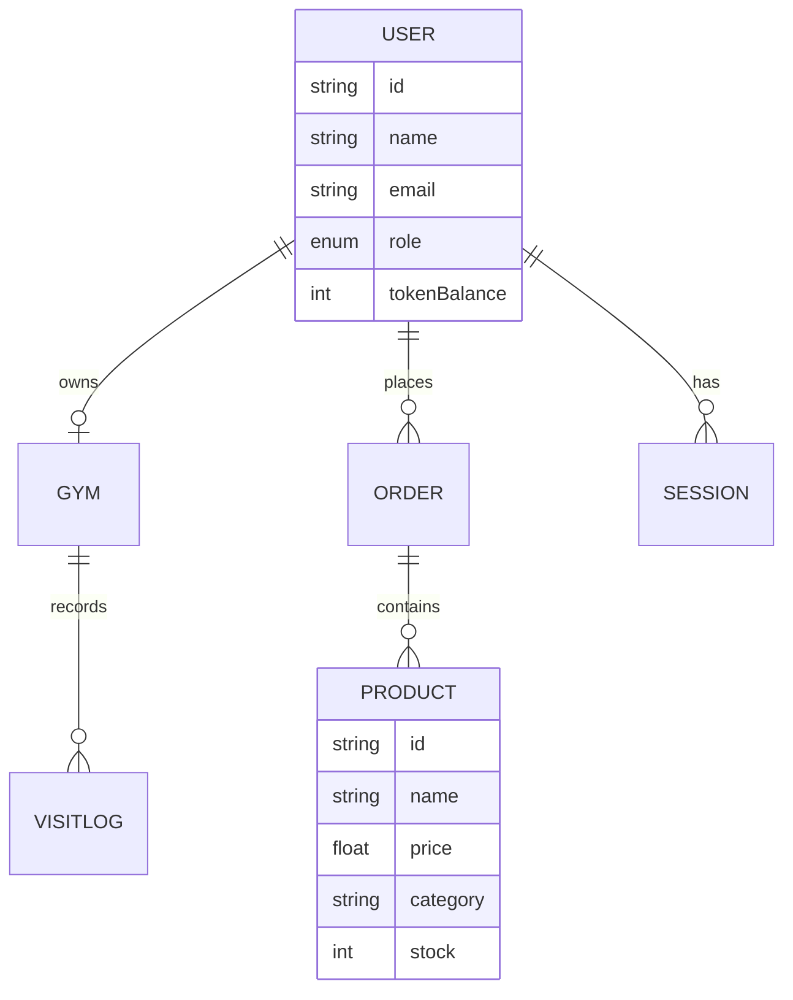

# Research Paper: Trendy Threads - AI-Driven Fitness Ecosystem

**Title**: Integrating Vectorless RAG and MongoDB for Real-Time AI Fitness Coaching and Product Recommendations  
**Author**: Antigravity AI Engineering  
**Date**: April 2026  

---

## 1. Abstract
This paper presents the architectural design and implementation of **Trendy Threads**, a modern fitness ecommerce platform that integrates a sophisticated AI Fitness Coach. Unlike traditional Retrieval-Augmented Generation (RAG) systems that rely heavily on vector databases and complex embedding pipelines, Trendy Threads utilizes a **Vectorless RAG** approach. This method leverages direct keyword-based retrieval from a **MongoDB** document store via **Prisma ORM**, combined with high-performance inference through the **Groq Llama 3.1** engine. The result is a low-latency, highly accurate recommendation engine that provides personalized fitness advice and contextual product suggestions based on real-time inventory and user-specific health goals.

## 2. Introduction
In the rapidly evolving fitness technology landscape, users demand more than just static workout plans; they require personalized, interactive coaching that connects their fitness goals directly to actionable advice and equipment recommendations. Trendy Threads addresses this by bridging the gap between an AI LLM and a dynamic product catalog. 

The core challenge addressed is the synchronization lag and complexity inherent in vector-based systems for structured data. By adopting a vectorless architecture, Trendy Threads ensures that every recommendation is backed by current database records, providing a "Source of Truth" that is both scalable and easy to maintain.

## 3. System Architecture
The Trendy Threads platform is built on a distributed, microservice-inspired architecture using the Next.js App Router for the frontend and API layers.

### 3.1 High-Level Architecture
The following diagram illustrates the interaction between the user interface, the AI engine, and the persistent data store.

## 4. Vectorless RAG Implementation
"Vectorless RAG" is a terminology used to describe a retrieval-augmentation strategy that avoids the traditional embedding-space search. Here is how it is implemented in Trendy Threads:

### 4.1 Keyword-Based Retrieval (KBR)
When a user asks for a workout plan or diet advice, the system does not search for "similar" documents in a vector space. Instead, it parses the query for intent and keyphrases (e.g., "muscle gain", "supplements", "dumbbells").

### 4.2 MongoDB & Prisma Integration
Prisma ORM is used to execute structured queries against the MongoDB database. This allows the system to:
1.  Filter products by `category` and `stock` availability.
2.  Fetch user profiles (height, weight, goals) for precise personalization.
3.  Inject the resulting JSON metadata directly into the LLM system prompt.

### 4.3 Chatbot Decision Flow
The following sequence diagram details the lifecycle of a single user message.

## 5. Product Recommendation Engine
The integration between the AI Fitness Coach and the shop facilitates a seamless conversion path. By accessing the `Product` model in MongoDB, the chatbot creates a "guided shopping" experience.

### 5.1 Database Schema
The data model is optimized for both fitness tracking and ecommerce.

## 6. Technology Stack
- **Next.js 14**: Server-side rendering and API routes for optimal performance.
- **Groq & Llama 3.1**: Selected for industry-leading inference speed (TPS), enabling near-instantaneous responses.
- **MongoDB**: Utilized for its flexible schema, allowing for the rapid storage of diverse fitness datasets (nutrition facts, exercise logs).
- **Prisma**: Provides type-safety and efficient query building for database interactions.

## 7. Conclusion
Trendy Threads demonstrates that a "vectorless" approach to RAG is not only feasible but superior for applications requiring tight integration with structured, rapidly changing data like product inventories. By leveraging the speed of Groq and the flexibility of MongoDB, the platform delivers a premium, AI-driven fitness experience that scales efficiently without the overhead of traditional vector-based search engines.
